# 🥷 Assassin Assemble
### *The Ultimate Web3 NFT Card Battle Game*


**Assassin Assemble** is a decentralized, turn-based card game built on the **Avalanche Blockchain**. Players summon their own unique Avatars (NFTs), create battles, and fight for supremacy using on-chain logic. 

---

## 🏗 System Architecture

The following diagram illustrates how the **Frontend** talks to the **Blockchain** to create a seamless gaming experience.

```mermaid
flowchart TD
    %% Styling for Dark Mode Compatibility
    classDef user fill:#2d3748,stroke:#fff,stroke-width:2px,color:#fff;
    classDef frontend fill:#4a5568,stroke:#63b3ed,stroke-width:2px,color:#fff;
    classDef blockchain fill:#2c5282,stroke:#f6e05e,stroke-width:2px,color:#fff;
    classDef contract fill:#744210,stroke:#f6e05e,stroke-width:2px,color:#fff;

    User((👤  User)) -->|Clicks 'Register'| FE[💻  Frontend\nReact + Ethers.js]
    
    subgraph Client_Side [Frontend Application]
        FE -->|Connects Wallet| Wallet(🦊 MetaMask)
        FE -->|Listens for Events| Listener[📡 Event Listener]
    end
    
    Wallet -->|Signs Transaction| RPC[🌐 Avalanche Fuji RPC]
    
    subgraph Blockchain_Layer [Avalanche Network]
        RPC -->|Broadcasts| SC{📜 Smart Contract\nAssignAssemble.sol}
        
        SC -->|1. Register Player| DB[(⛓️ On-Chain Data)]
        SC -->|2. Mint NFT| NFT[🃏 Game Token]
        SC -->|3. Create/Join Battle| Battle[⚔️ Battle Logic]
        
        Battle -->|Emits Event| Events(⚡ Events:\nNewPlayer, NewBattle, BattleMove)
    end
    
    Events -.->|Updates UI| Listener
    Listener -.->|Refreshes Data| FE

    class User user;
    class FE,Wallet,Listener frontend;
    class RPC blockchain;
    class SC,DB,NFT,Battle,Events contract;
```



---

## 🧠 Core Concepts

### 1. **The Smart Contract (The Brain)**
Instead of a traditional database, the game state lives on the **Blockchain**.
-   **Identity**: Your Wallet Address is your User ID.
-   **Assets**: Your Game Card is an **NFT** (ERC-1155 Token) created specifically for you.
-   **Safety**: All battle logic (who wins, health calculation) happens on-chain, meaning no one can cheat.

### 2. **The Frontend (The Face)**
A **React** application that makes the blockchain look like a high-end game.
-   **Context API**: Manages the connection to MetaMask.
-   **Event Listeners**: "Watches" the blockchain for updates (e.g., "Player 2 joined your battle!") and updates the screen instantly.

---

## 🎮 How to Play

1.  **Register (Summoning)**:
    -   Enter your name.
    -   The contract mints a unique **NFT Card** for you with random stats (Attack & Defense).
    
2.  **Create or Join**:
    -   **Create**: You start a listening room (Battle) on the blockchain.
    -   **Join**: Browse the list of pending battles and join one.

3.  **Battle (Turn-Based)**:
    -   **Card A vs Card B**: You choose to **Attack** or **Defend**.
    -   **Mana**: Attacking costs 3 Mana. Defending restores 3 Mana.
    -   **Health**: If your Attack > Enemy Defense, they lose health.
    
4.  **Win Condition**:
    -   First player to reach **0 Health** loses.
    -   The winner is recorded forever on the blockchain.

---

## 🛠 Tech Stack

-   **Language**: Solidity (v0.8.16)
-   **Framework**: Hardhat
-   **Network**: Avalanche Fuji Testnet
-   **Frontend Library**: React.js
-   **Build Tool**: Vite
-   **Styling**: Tailwind CSS
-   **Web3 Library**: Ethers.js v5

---

## 🚀 Getting Started

### Prerequisites
-   **Node.js** (v16+)
-   **MetaMask Wallet** (Browser Extension)
-   **Funds**: Some testnet AVAX (Get it from [Avalanche Faucet](https://faucets.chain.link/fuji))

### 1. Installation

```bash
# Clone the repo
git clone https://github.com/Anshuman-Jha/AssasinAssemble.git

# Install Dependencies (Backend)
cd web3
npm install

# Install Dependencies (Frontend)
cd ../client
npm install
```

### 2. Deployment (Optional - Already Live)
*Note: The contract is already deployed on Fuji, but if you want to deploy your own:*

```bash
cd web3
# Create .env file with PRIVATE_KEY=...
npx hardhat run scripts/deploy.ts --network fuji
```

### 3. Run Locally

```bash
cd client
npm run dev
```
Open `http://localhost:5173` and start battling!


